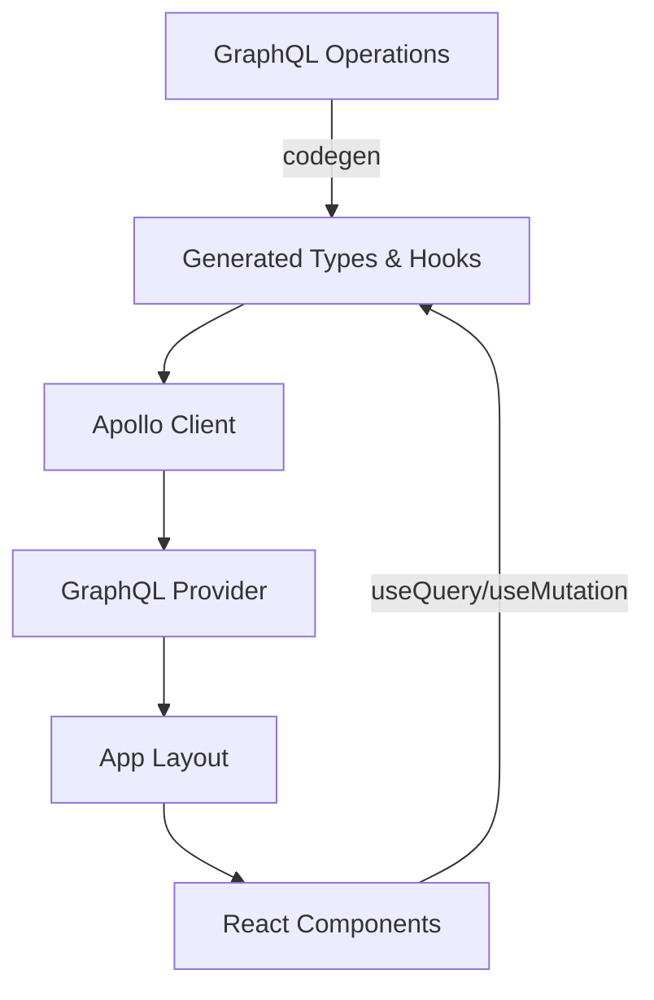

# GraphQL and GraphQL Codegen Implementation Plan

## Overview

This plan implements GraphQL with Apollo Client and GraphQL Code Generator in the tapcrm Next.js project, following the pattern from the reference implementation.

## Architecture




## Implementation Steps

### 1. Install Dependencies

Add the following packages to `package.json`:**Dependencies:**

- `@apollo/client` - Apollo Client for React
- `graphql` - GraphQL library

**DevDependencies:**

- `@graphql-codegen/cli` - Code generation CLI
- `@graphql-codegen/typescript` - TypeScript types generator
- `@graphql-codegen/typescript-operations` - Operations types generator
- `@graphql-codegen/typescript-react-apollo` - React Apollo hooks generator
- `dotenv` - Environment variable support

### 2. Create Environment Configuration

Create `.env.local` file with:

```javascript
NEXT_PUBLIC_API_BASEURL=http://localhost:4000/graphql
```

(Placeholder URL - update with actual GraphQL endpoint)

### 3. Create GraphQL Code Generator Configuration

Create `codegen.ts` at project root:

- Configure schema URL from `NEXT_PUBLIC_API_BASEURL`
- Set documents pattern: `src/graphql/operation/**/*.graphql`
- Generate output to: `src/graphql/generated/graphql.ts`
- Use plugins: `typescript`, `typescript-operations`, `typescript-react-apollo`
- Enable `useTypeImports: true`

### 4. Create Apollo Client Setup

Create `src/apollo/client.ts`:

- Initialize Apollo Client with InMemoryCache
- Use `NEXT_PUBLIC_API_BASEURL` as the GraphQL endpoint URI
- Export default client instance

### 5. Create GraphQL Provider

Create `src/graphql/GraphQlProvider.tsx`:

- Client component wrapper for ApolloProvider
- Accepts children prop
- Wraps children with ApolloProvider using the client

### 6. Create GraphQL Directory Structure

Create directories:

- `src/graphql/operation/` - For `.graphql` operation files
- `src/graphql/generated/` - For generated TypeScript files (gitignored)

### 7. Update Root Layout

Modify `src/app/layout.tsx`:

- Import GraphQlProvider
- Wrap children with GraphQlProvider (must be client-side compatible)
- Ensure proper client/server component boundaries

### 8. Add NPM Scripts

Add to `package.json` scripts:

- `"codegen": "graphql-codegen --config codegen.ts"` - Run code generation
- Optionally: `"codegen:watch": "graphql-codegen --config codegen.ts --watch"` - Watch mode

### 9. Create Sample GraphQL Operation

Create `src/graphql/operation/example.graphql`:

- Add a sample query to verify the setup works
- Can be removed/replaced with actual operations later

### 10. Update TypeScript Configuration

Verify `tsconfig.json`:

- Ensure path aliases support `@/*` or `src/*` imports
- Current config already has `@/*` paths configured

### 11. Update .gitignore

Add to `.gitignore`:

- `src/graphql/generated/` - Generated files should not be committed
- `.env.local` - Environment variables

## File Structure After Implementation

```javascript
tapcrm/
├── codegen.ts                    # NEW - GraphQL Code Generator config
├── .env.local                    # NEW - Environment variables
├── package.json                  # MODIFIED - Added dependencies & scripts
├── src/
│   ├── apollo/
│   │   └── client.ts            # NEW - Apollo Client instance
│   ├── graphql/
│   │   ├── GraphQlProvider.tsx  # NEW - Apollo Provider wrapper
│   │   ├── operation/
│   │   │   └── example.graphql  # NEW - Sample GraphQL operation
│   │   └── generated/           # NEW - Generated files (gitignored)
│   │       └── graphql.ts
│   └── app/
│       └── layout.tsx            # MODIFIED - Add GraphQlProvider
```


## Usage Pattern

After implementation, developers can:

1. **Write GraphQL operations** in `src/graphql/operation/*.graphql` files
2. **Run codegen** with `npm run codegen` to generate TypeScript types and hooks
3. **Use generated hooks** in components:
   ```typescript
         import { useExampleQuery } from '@/graphql/generated/graphql';
   ```


## Notes

- The GraphQL Provider must be a client component (`'use client'`)
- Generated files are gitignored and should be regenerated after schema changes