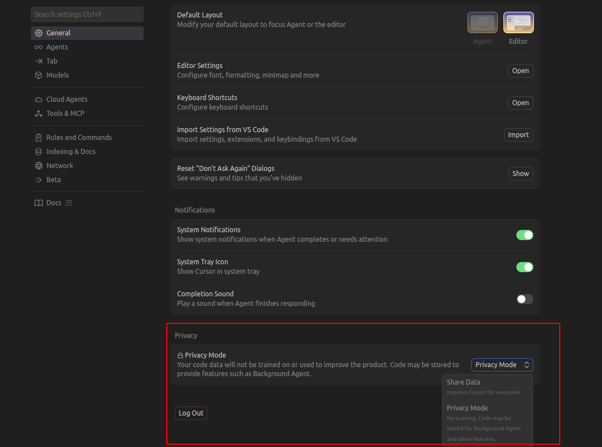

# Risks, Ethics, and Guardrails


AI increases speed.\
It also increases risk if used carelessly.


### Reality Check

* AI **hallucinates confidently**
* AI can introduce **subtle, hard-to-detect bugs**
* AI can **leak sensitive data** if misused
* AI does not understand **legal, security, or business impact**

If you trust AI blindly, the failure is on you.

***

### ⚠️ Risk 1. AI Hallucination

* AI can generate code that:
  * Looks correct
  * Compiles successfully
  * Is logically wrong
* <mark style="color:red;">**Hallucinations are more dangerous than syntax errors**</mark>

**Rule**

* Plausible ≠ Correct

### ⚠️ Risk 2. Subtle Bugs

**AI often introduces:**

* Incorrect edge-case handling
* Wrong assumptions about data
* Incomplete validation
* Performance issues under load

**These bugs:**

* Pass basic tests
* Fail in production

### ⚠️ Risk 3. Data Leakage

AI tools can expose data if misused.

#### Never paste:

* API keys or secrets
* Access tokens
* Passwords
* Private certificates
* Customer PII
* Proprietary business logic
* Internal URLs or credentials

Assume anything you paste **can leave your system**.

***

### ❌ What NOT to Use AI For

* Authentication logic without review
* Authorization and permission checks
* Payment or financial calculations
* Compliance-related logic
* Security-sensitive flows

AI can assist.\
AI must not decide.

***

### Ethics and Responsibility

* AI does not take responsibility
* AI does not get paged for incidents
* AI does not face audits

**The developer always owns the outcome**

***

### Company Policies (Non-Negotiable)

* Follow the company AI usage guidelines
* Use only approved tools and integrations
* Respect data classification rules
* Do not bypass security controls for convenience

If the policy is unclear, default to **not using AI**.

<figure><figcaption></figcaption></figure>

***

### Human Review Is Mandatory

AI-generated output must be:

* Reviewed
* Understood
* Validated
* Tested

No exceptions.

***

### Simple Guardrails to Enforce

* Never “Accept All” blindly
* Always review diffs
* Run tests after AI changes
* Treat AI like a junior engineer
* Ask “What could break?” before merging

***

### One Rule to End This Section

> **AI can help you move fast.**\
> **Guardrails are what prevent you from breaking production faster.**
